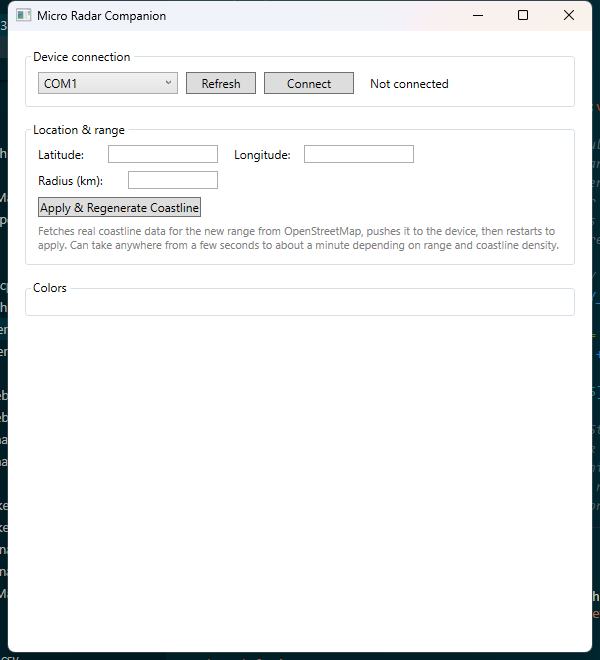

<h1 align=center>
  🖥️ Micro Radar Companion
</h1>
<h6 align=center>
  a Windows desktop app for configuring your <a href="https://github.com/NZFunGi/micro-radar">Micro Radar</a> over USB
</h6>
<p align=center>
  
</p>
<p align=center>
  <a href="#what-it-does">WHAT IT DOES</a> - <a href="#getting-started">GETTING STARTED</a> - <a href="#usage">USAGE</a> - <a href="#faq">FAQ</a>
</p>

## What it does

The Micro Radar device stores its color palette, location, and range in flash, and can be reconfigured live over its USB serial connection without a firmware rebuild. This app is the easiest way to do that:

- **Live color pickers** for the sea, land, radar rings, and each aircraft category (light/large/heavy/rotorcraft/glider/unknown) - changes apply on the device's very next drawn frame, no restart needed. Pick from a native color dialog or type a hex code directly.
- **Location & range** - edit latitude, longitude, and radius (shown in km).
- **One-click coastline regeneration** - fetches real coastline data from OpenStreetMap for whatever location/range you set, classifies land vs sea, and pushes the result to the device. This is what actually lets you point the radar anywhere in the world and get an accurate coastline overlay, not just the one location baked into the firmware.

## Getting Started

### Option A: Download a build

Check the [Releases](../../releases) page for a ready-to-run `MicroRadarCompanion.exe` - it's fully self-contained (the whole .NET runtime is bundled in), so it runs on a Windows machine that's never had .NET installed. Just download and double-click it.

### Option B: Build from source

You'll need the [.NET 8 SDK](https://dotnet.microsoft.com/download). Then, from the project folder:

```
dotnet build
```

to build and run via your IDE, or:

```
dotnet publish -c Release
```

to produce a single-file executable at `bin\Release\net8.0-windows\win-x64\publish\MicroRadarCompanion.exe`.

## Usage

1. Plug your Micro Radar device into a USB port.
2. Open the app, pick the correct COM port from the dropdown (use **Refresh** if it doesn't show up right away), and click **Connect**.
3. Once connected, the app reads the device's current colors, location, and range.
4. **To change colors**: click **Change...** next to any color to open a picker, or type a 6-digit hex code (e.g. `B0C4D2`) into the box and click **Set** / press Enter.
5. **To change location or range**: edit the fields and click **Apply & Regenerate Coastline**. This fetches real coastline data for the new location/range from OpenStreetMap, pushes it to the device, then restarts the device to apply everything. Depending on range and coastline complexity, this can take anywhere from a few seconds to about a minute - the log line at the bottom shows progress.

## FAQ

> The port dropdown is empty, or my device doesn't show up

Click **Refresh** - the device may have been plugged in after the app started. If it's still missing, check Windows Device Manager under "Ports (COM & LPT)" to confirm the device is recognized at all.
<br/><br/>

> "Connect failed: The operation has timed out"

The device resets when a new USB connection opens (same as plugging into any Arduino-family board) and can take a few seconds to finish booting, connect to WiFi, and settle down before it's ready to answer. Just try **Connect** again.
<br/><br/>

> "Apply & Regenerate Coastline" is stuck on "Fetching coastline data..." for a long time, or fails

This step calls the public [Overpass API](https://overpass-api.de) (OpenStreetMap's query service), which is a free, best-effort service with no guaranteed uptime or rate limit. If you've made several requests in a short time (testing different locations, for example), it may temporarily return errors or time out. Wait a few minutes and try again.
<br/><br/>

> How accurate is the generated coastline?

It's built from real OpenStreetMap coastline data, so it's as accurate as OpenStreetMap is for your area - which for most populated coastlines is very good. The device only has a 60x60 grid to render into regardless of range, so at very large ranges (100s of km) fine detail like small islands or narrow inlets may not show individually.
<br/><br/>

> Do I need an OpenSky account for this app specifically?

No - OpenSky credentials are configured on the device itself (via its own web config page at `http://microradar.local`), not through this app. This app only handles colors, location, range, and coastline data.
<br/><br/>

> Can I run this on macOS or Linux?

Not currently - it's a Windows-only WPF application. The device itself and its web config page work from any OS; this app is specifically for the extra features (color pickers, coastline regeneration) that aren't available through the web config page.

## Notes

> Built to work alongside [NZFunGi/micro-radar](https://github.com/NZFunGi/micro-radar), a fork of [AnthonySturdy/micro-radar](https://github.com/AnthonySturdy/micro-radar)
